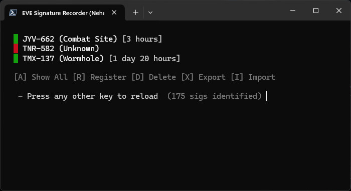

# EVE Signature Tracker

A simple tool to track cosmic signatures in EVE Online. On keypress loads your copied signature data and shows what you've already identified.

## Quick Start

### Windows Users
1. **Double-click** `EVE Sig Analyzer.lnk` to run the tool
2. **Copy** signature data from EVE's scanner
3. **Press any key** - the tool reads your clipboard automatically

### Mac Users
1. **Open Terminal**
2. **Navigate** to the folder: `cd /path/to/eve-sigs`
3. **Run**: `powershell -ExecutionPolicy Bypass -File evesigs.ps1`
4. **Copy** signature data from EVE's scanner
5. **Press any key** - the tool reads your clipboard automatically

## What It Does

- **Auto-detects** signatures from EVE's clipboard
- **Stores** data locally with timestamps
- **Shows** signature age (e.g., "1 day 13 hours")
- **Shares** data between players
- **Cleans up** old signatures automatically

## Menu Options

- **[A]** Show all signatures
- **[R]** Add signature manually
- **[D]** Delete signature
- **[X]** Export data for sharing
- **[I]** Import shared data

## Data Sharing

**Export**: Press `X` - data copied to clipboard
**Import**: Press `I` - paste shared data

## Files

- `evesigs.ps1` - Main script
- `evesigs.csv` - Your signature database (auto-created)
- `EVE Sig Analyzer.lnk` - Windows shortcut only

## Requirements

- **Windows**: PowerShell (built-in)
- **Mac**: PowerShell Core (install via Homebrew: `brew install powershell`)

---

*Made by Nehalennia | Started 2020-10-26*
